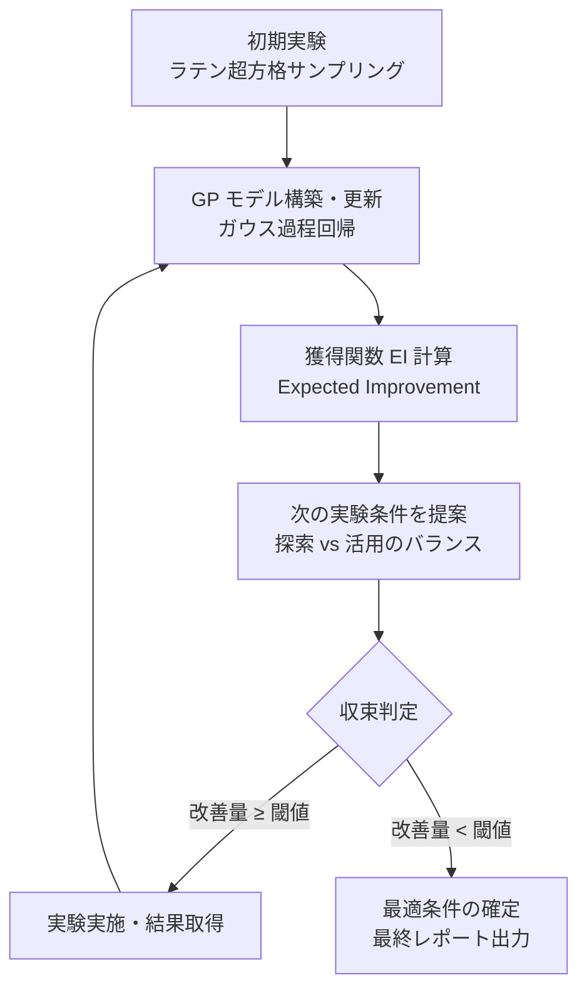
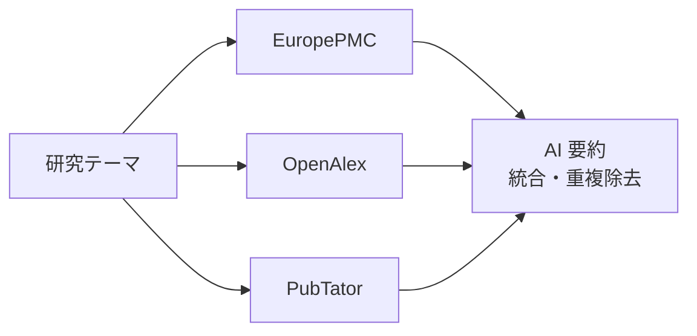
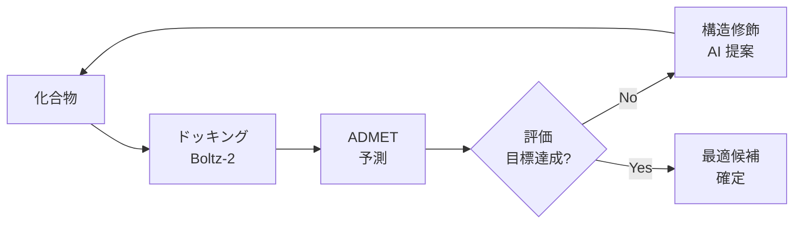

# AI for Science プロンプトエンジニアリング・ガイドブック

> **対象読者**: 様々な分野の研究者（生命科学・化学・材料科学・環境科学・医学・計算科学）  
> **前提知識**: CoreClaw の基本操作（[**「はじめての CoreClaw｜Agent Skills プラグインで拡張する汎用 AI エージェント OS」**](https://qiita.com/hisaho/items/7ff94c306db3785f4e68) 参照）  
> **目標**: 自然言語プロンプトだけで、文献検索から実験計画まで研究パイプラインを構築できるようになる

---

## このガイドの使い方

本ガイドは **4 つのレベル** で段階的に進みます。最初は単一の質問を投げるところから始め、最終的には「論文検索 → 知識グラフ作成 → ギャップ分析 → 実験計画」のような高度なマルチステップパイプラインを自律的に構築できるようになります。

```
Level 1: 単一スキル呼び出し        ← まずここから
Level 2: 2-3 スキル連携パイプライン
Level 3: ToolUniverse MCP 連携
Level 4: 高度なマルチステップパイプライン  ← 最終目標
```

各レベルには **そのままコピペして使えるプロンプト例** を掲載しています。`[角括弧]` の部分を自分の研究テーマに置き換えてください。

# Level 1: 単一スキルの呼び出し

## 1.1 プロンプトの基本構造

CoreClaw のスキルは **自然言語で指示するだけ** で自動的に適切なスキルが選択・実行されます。効果的なプロンプトには以下の 4 要素を含めます。

```
① 何をしたいか（タスク）
② 対象は何か（研究テーマ・データ）
③ どのレベルで（深さ・範囲）
④ 出力形式（レポート・図表・コード）
```

### 悪い例 ❌

```
遺伝子について調べて
```

→ 範囲が広すぎて、スキルが適切に選択できない

### 良い例 ✅

```
BRCA1/BRCA2 遺伝子変異と乳がんリスクの関連について、
2020年以降の論文を PubMed と Semantic Scholar で検索し、
主要な知見を表形式でまとめたレポートを作成してください。
```

→ タスク（文献検索＋レポート作成）、対象（BRCA1/BRCA2 × 乳がん）、範囲（2020年以降）、出力（表形式レポート）が明確

## 1.2 文献検索プロンプト

**発火スキル**: `scientific-literature-search`（PubMed / Semantic Scholar / OpenAlex / EuropePMC / CrossRef の 5 DB 統合）

### ToolUniverse 経由で利用可能な文献検索ツール一覧

CoreClaw の Scientist Skills は ToolUniverse MCP 経由で **15 の文献検索ツール** にアクセスできます。分野や目的に応じて最適なツールを選択してください。

#### プレプリントアーカイブ

| ツール名 | 対象分野 | 呼び出し例 | API キー |
|---------|---------|-----------|----------|
| `ArXiv_search_papers` | 物理学、数学、計算機科学、統計学、電気工学、経済学 | `{"query": "quantum computing", "limit": 10, "sort_by": "relevance"}` | **不要** |
| `BioRxiv_search_preprints` | 生物学全般（プレプリント） | `{"query": "CRISPR gene editing", "max_results": 10}` | **不要** |
| `MedRxiv_search_preprints` | 医学・臨床研究（プレプリント） | `{"query": "COVID-19 treatment", "max_results": 10}` | **不要** |
| `HAL_search_archive` | フランス学術アーカイブ（全分野） | `{"query": "mathematics statistics", "max_results": 10}` | **不要** |

#### 学術データベース

| ツール名 | 対象分野 | 呼び出し例 | API キー |
|---------|---------|-----------|----------|
| `PubMed_search_articles` | 医学・生命科学（3,700万件+） | `{"query": "cancer immunotherapy", "limit": 10}` | ⚠️ **推奨**: `NCBI_API_KEY`（レート制限 3→10件/秒に緩和。[取得先](https://account.ncbi.nlm.nih.gov/settings/)、無料） |
| `EuropePMC_search_articles` | バイオメディカル文献（3,900万件+） | `{"query": "protein folding", "limit": 10}` | **不要** |
| `SemanticScholar_search_papers` | 全分野・AI パワード類似論文検索 | `{"query": "deep learning", "limit": 10}` | **不要**（API キー設定で上限緩和可。[取得先](https://www.semanticscholar.org/product/api#api-key)、無料） |
| `openalex_literature_search` | 全分野（2.5億件+、著者・機関メトリクス） | `{"search_keywords": "AI drug discovery", "max_results": 10, "year_from": 2020, "open_access": true}` | **不要**（`mailto` パラメータ設定でポライトプール利用可） |
| `Crossref_search_works` | 全分野・DOI メタデータ（1.5億件+） | `{"query": "machine learning", "limit": 10, "filter": "type:journal-article"}` | **不要**（`mailto` 設定でポライトプール利用可） |
| `DBLP_search_publications` | 計算機科学（会議・ジャーナル特化） | `{"query": "graph neural networks", "max_results": 10}` | **不要** |

#### オープンアクセス・全文取得

| ツール名 | 対象分野 | 呼び出し例 | API キー |
|---------|---------|-----------|----------|
| `DOAJ_search_articles` | オープンアクセスジャーナル検索 | `{"query": "renewable energy", "max_results": 10, "type": "articles"}` | **不要** |
| `Unpaywall_check_oa_status` | DOI からオープンアクセス版を検索 | `{"doi": "10.1038/nature12373", "email": "user@example.com"}` | **不要**（`email` パラメータ必須） |
| `CORE_search_papers` | 世界最大のOA論文コレクション | `{"query": "climate change", "limit": 10}` | ⚠️ **必要**: `CORE_API_KEY`（[取得先](https://core.ac.uk/services/api)、無料） |
| `PMC_search_papers` | PubMed Central 全文バイオメディカル文献 | `{"query": "single cell RNA-seq", "limit": 10}` | ⚠️ **推奨**: `NCBI_API_KEY`（PubMed と共通。[取得先](https://account.ncbi.nlm.nih.gov/settings/)、無料） |
| `Zenodo_search_records` | オープンリサーチデータ・出版物リポジトリ | `{"query": "genomics dataset", "max_results": 10}` | **不要** |

:::note info
**ツールの選び方ガイド**
- **医学・生命科学** → `PubMed_search_articles` + `EuropePMC_search_articles`
- **計算機科学** → `DBLP_search_publications` + `ArXiv_search_papers`
- **全分野の網羅的検索** → `openalex_literature_search` + `SemanticScholar_search_papers`
- **最新の未査読研究** → `BioRxiv_search_preprints` / `MedRxiv_search_preprints` / `ArXiv_search_papers`
- **オープンアクセス版の探索** → `Unpaywall_check_oa_status` + `DOAJ_search_articles`
- **系統的レビュー（多DB横断）** → 上記を組み合わせて Broadcasting パターンで実行
:::

#### API キー設定方法

ToolUniverse MCP の環境変数として設定します。

```jsonc
// CoreClaw の MCP 設定（container/mcp-servers.json 等）
{
  "mcpServers": {
    "tooluniverse": {
      "command": "uvx",
      "args": ["tooluniverse"],
      "env": {
        "PYTHONIOENCODING": "utf-8",
        "NCBI_API_KEY": "あなたのキー",
        "CORE_API_KEY": "あなたのキー"
      }
    }
  }
}
```

:::note warn
**API キーがなくても動作するツールが大半です。** `NCBI_API_KEY` はレート制限の緩和（3→10 リクエスト/秒）のため推奨ですが、必須ではありません。まずはキーなしで試し、必要に応じて追加してください。
:::

### テンプレート A: 基本文献検索

```
[研究テーマ] に関する最新の研究動向を調査してください。

検索条件:
- 対象データベース: PubMed, Semantic Scholar
- 期間: [YYYY]年以降
- 最大取得件数: [50]件
- 言語: 英語

出力:
- 検索結果の CSV ファイル（タイトル、著者、年、引用数、アブストラクト）
- 主要な知見のサマリーレポート（report.md）
- 年別の出版数推移グラフ
```

### テンプレート B: 系統的検索（Systematic Review 向け）

```
以下のテーマで系統的文献検索を実施してください。

PICO フレームワーク:
- P (Population): [対象集団]
- I (Intervention): [介入・処理]
- C (Comparison): [比較対照]
- O (Outcome): [アウトカム]

検索戦略:
- PubMed MeSH 構造化クエリを構築
- EuropePMC で全文検索
- CrossRef で DOI メタデータ補完
- 重複除去

出力:
- PRISMA フローダイアグラム
- 検索戦略の詳細記録（再現性のため）
- 抽出データの CSV
```

### テンプレート C: 引用ネットワーク分析

```
以下の論文を起点に、引用/被引用ネットワークを構築してください。

起点論文:
- PMID: [12345678]
- PMID: [23456789]

パラメータ:
- 探索深度: 2（直接引用＋間接引用）
- 各レベル最大ノード数: 30

出力:
- ネットワーク図（figures/citation_network.png）
- GraphML ファイル（results/citation_network.graphml）
- ハブ論文（被引用数上位10）のリスト
```

## 1.3 仮説立案プロンプト

**発火スキル**: `scientific-hypothesis-pipeline`

このスキルは、自然言語プロンプトから **検証可能な研究仮説を自動立案** し、仮説検証のための解析パイプラインをコードとして生成します。「仮説を立てて」「このデータで何がわかる？」「解析パイプラインを作って」で発火します。

### 仮説立案の 4 フェーズ

スキルは以下の 4 フェーズで仮説を体系的に構築します。

```
Phase 1: プロンプト解析
  ├─ 研究テーマの抽出
  ├─ データの種類・構造の推定
  └─ 変数（独立・従属・交絡）の特定

Phase 2: 仮説立案
  ├─ PICO / PECO フレームワークで構造化
  ├─ 帰無仮説 (H₀) / 対立仮説 (H₁) の定式化
  └─ 複数仮説の優先順位付け（多重比較補正の自動判定）

Phase 3: パイプライン設計
  ├─ 比較構造 × データ型から適切な解析手法を自動選択
  ├─ 検出力分析によるサンプルサイズ計算
  └─ ワークフロー設計書の保存（docs/workflow_design.md）

Phase 4: コード生成
  ├─ scientific-pipeline-scaffold ベースのスクリプト自動生成
  ├─ 各ステップに対応するスキルのコードを組み込み
  └─ 仮説検証結果を JSON サマリーとして出力
```

### 仮説フレームワーク：PICO と PECO

研究の種類に応じて 2 つのフレームワークを使い分けます。どちらも「研究の問い」を **構造化** し、曖昧さを排除して検証可能な仮説に変換するための枠組みです。

#### PICO フレームワーク（介入研究向け）

**PICO** は、研究者が **実験的に条件を操作できる** 研究で使います。「ある処理・介入を行ったら、結果が変わるか？」を検証する研究デザインです。

| 要素 | 意味 | 記入するもの | 質問 |
|------|------|------------|------|
| **P** (Population) | 対象集団 | 研究対象の母集団・サンプル | 「**誰/何** を対象にするか？」 |
| **I** (Intervention) | 介入・処理 | 研究者が意図的に操作する条件・処理 | 「**何をする** のか？」 |
| **C** (Comparison) | 比較対照 | 介入を行わない群、または別の介入群 | 「**何と比較する** のか？」 |
| **O** (Outcome) | アウトカム | 測定する結果指標 | 「**何を測る** のか？」 |

**適用分野の例:**

| 分野 | P | I | C | O |
|------|---|---|---|---|
| **材料科学** | Ti-6Al-4V 合金試料 | 熱処理温度 500-900°C | 未処理（as-cast）試料 | ビッカース硬さ (HV) |
| **創薬** | HEK293 細胞株 | 候補化合物 X 処理（10μM） | DMSO コントロール | 細胞生存率 (%) |
| **農学** | 水稲品種コシヒカリ | 有機肥料 vs 化学肥料 | 無施肥区 | 収穫量 (kg/ha) |
| **環境科学** | 河川底質サンプル | 微生物処理（バイオレメディエーション） | 無処理区 | 重金属濃度 (mg/kg) |
| **臨床試験** | 2 型糖尿病患者 (n=200) | 新薬 A（500mg/日） | プラセボ | HbA1c 変化量 |

**PICO から仮説への変換:**
```
P: Ti-6Al-4V 合金試料
I: 熱処理温度を 500-900°C で変化
C: 未処理（as-cast）試料
O: ビッカース硬さ (HV)

→ H₁: 熱処理温度は Ti-6Al-4V 合金のビッカース硬さに有意な影響を与える
→ H₀: 熱処理温度は Ti-6Al-4V 合金のビッカース硬さに影響を与えない
→ 推奨検定: 一元配置分散分析 (ANOVA) + Tukey HSD 多重比較
```

#### PECO フレームワーク（観察研究向け）

**PECO** は、研究者が **条件を操作できない** 観察研究で使います。「自然に存在する曝露因子と結果の間に関連があるか？」を検証する研究デザインです。倫理的に介入できない場合（例: 喫煙と肺がんの関係）や、大規模コホートデータを分析する場合に使います。

| 要素 | 意味 | 記入するもの | 質問 |
|------|------|------------|------|
| **P** (Population) | 対象集団 | 研究対象の母集団・コホート | 「**誰/何** を対象にするか？」 |
| **E** (Exposure) | 曝露因子 | 自然に存在する・既に起きている因子 | 「**何に曝露** されているか？」 |
| **C** (Comparison) | 比較対照 | 曝露されていない群、または低曝露群 | 「**何と比較する** のか？」 |
| **O** (Outcome) | アウトカム | 測定する結果指標 | 「**何を測る** のか？」 |

**適用分野の例:**

| 分野 | P | E | C | O |
|------|---|---|---|---|
| **疫学** | 大腸がん患者コホート (n=500) | 腸内細菌叢の多様性 (Shannon index) | 健常者コントロール群 | 5 年生存率 |
| **環境疫学** | 都市部住民 (n=10,000) | PM2.5 年間曝露量 (μg/m³) | 低曝露地域住民 | 呼吸器疾患発症率 |
| **ゲノミクス** | がん患者 (TCGA コホート) | BRCA1 変異の有無 | 野生型キャリア | 無再発生存期間 |
| **生態学** | サンゴ礁群集 | 海水温上昇 (°C) | 過去 30 年の平均水温 | 白化率 (%) |
| **社会科学** | 大学生 (n=3,000) | 週あたりの運動時間 | 非運動群（週 0 時間） | GPA, ストレススコア |

**PECO から仮説への変換:**
```
P: 大腸がん患者コホート (n=500)
E: 腸内細菌叢の多様性 (Shannon index)
C: 健常者コントロール群
O: 5 年生存率

→ H₁: 腸内細菌叢の多様性が高い大腸がん患者は低い患者と比較して 5 年生存率が有意に高い
→ H₀: 腸内細菌叢の多様性と 5 年生存率の間に有意な関連はない
→ 推奨検定: Kaplan-Meier + Log-rank 検定、Cox 比例ハザードモデル
```

#### PICO と PECO の選択基準

```
研究者が条件を操作（コントロール）できるか？
  │
  ├─ YES → PICO を使う
  │   例: 薬の投与量を変える、温度を設定する、肥料の種類を選ぶ
  │
  └─ NO  → PECO を使う
      例: 遺伝子変異の有無、環境汚染への曝露、生活習慣
```

:::note info
**プロンプトのコツ**: フレームワークが分からなくても、研究テーマを自然言語で記述すれば、スキルが自動的に PICO/PECO を判定して構造化します。ただし、自分で P/I(E)/C/O を明示するとより正確な仮説が生成されます。
:::

### 解析手法の自動選択マッピング

スキルはデータの「比較構造」と「変数の型」から適切な統計手法とサブスキルを自動選択します。各手法の詳細な説明は **[付録 E. 統計手法リファレンス](#e-統計手法リファレンス)** を参照してください。

| 比較構造 | 従属変数 | 独立変数 | 推奨手法 | 参照スキル |
|---------|---------|---------|---------|-----------|
| 2 群比較 | 連続（正規） | カテゴリカル | Welch t 検定 | `scientific-statistical-testing` |
| 2 群比較 | 連続（非正規） | カテゴリカル | Mann-Whitney U 検定 | `scientific-statistical-testing` |
| 多群比較 | 連続（正規） | カテゴリカル | ANOVA + Tukey HSD | `scientific-statistical-testing` |
| 多群比較 | 連続（非正規） | カテゴリカル | Kruskal-Wallis + Dunn | `scientific-statistical-testing` |
| 相関 | 連続 | 連続 | Pearson / Spearman | `scientific-eda-correlation` |
| 回帰 | 連続 | 連続/混合 | Linear / Ridge / RF | `scientific-ml-regression` |
| 分類 | カテゴリカル | 連続/混合 | RF / SVM / XGBoost | `scientific-ml-classification` |
| 時系列 | 連続 | 時間 | STL 分解 / ARIMA | `scientific-time-series` |
| 生存分析 | イベント時間 | 混合 | Kaplan-Meier / Cox PH | `scientific-survival-clinical` |
| 因果推論 | 連続/二値 | 混合 | PSM / DiD / IV | `scientific-causal-inference` |
| 用量応答 | 連続 | 連続 | RSM / GP | `scientific-process-optimization` |
| 次元削減 | 高次元 | — | PCA / t-SNE / UMAP | `scientific-pca-tsne` |

### 生成される成果物

| ファイル | 形式 | 内容 |
|---------|------|------|
| `docs/hypothesis.md` | Markdown | 仮説定義書（人間可読） |
| `docs/hypothesis.json` | JSON | 仮説定義（後続スキルが参照） |
| `docs/workflow_design.md` | Markdown | ワークフロー設計書 |
| `docs/workflow_design.json` | JSON | パイプライン再構築用 |
| `exp_analysis.py` | Python | 仮説駆動パイプラインスクリプト |
| `results/analysis_summary.json` | JSON | 仮説検証結果サマリー |
| `results/hypothesis_tests.csv` | CSV | 検定結果一覧 |
| `results/power_analysis.csv` | CSV | 検出力分析結果 |

### プロンプトから仮説が生成されるまでの対応例

| プロンプト例 | 生成される仮説 (H₁) | 自動選択スキル |
|---|---|---|
| 「熱処理温度が合金の硬さに与える影響を調べたい」 | 熱処理温度は硬さに有意な影響を与える | `statistical-testing` + `doe` |
| 「遺伝子発現データからがんのサブタイプを分類したい」 | 遺伝子発現パターンによりサブタイプを区別できる | `pca-tsne` + `ml-classification` |
| 「新薬の投与量と効果の関係を最適化したい」 | 投与量と効果の間に有意な用量応答関係がある | `doe` + `process-optimization` |
| 「患者の生存率に影響する因子を特定したい」 | 特定の臨床因子は生存率に有意な影響を持つ | `survival-clinical` + `feature-importance` |
| 「スペクトルデータから材料の組成を予測したい」 | スペクトル特徴量から組成を高精度で予測できる | `spectral-signal` + `ml-regression` |
| 「メタボロームデータで疾患群と健常群を比較したい」 | 代謝物プロファイルに有意差がある | `metabolomics` + `statistical-testing` |

### テンプレート D: データからの仮説立案

```
以下のデータ/研究テーマから検証可能な仮説を立案してください。

研究テーマ: [テーマ記述]
データの概要:
- サンプル数: [N]
- 変数: [変数リスト]
- データ型: [連続/カテゴリカル/時系列/テキスト]

要求:
1. PICO/PECO フレームワークで仮説を構造化
2. 帰無仮説 (H₀) と対立仮説 (H₁) を定式化
3. 適切な統計検定を提案
4. 検証パイプラインのコードを生成
5. サンプルサイズ・検出力の見積もり
```

### 具体例: 材料科学

```
Ti-6Al-4V チタン合金の熱処理条件と機械的特性の関係を調べたい。

データ:
- 熱処理温度: 500, 600, 700, 800, 900°C（各温度 n=10）
- 測定項目: ビッカース硬さ (HV), 引張強さ (MPa), 伸び (%)
- 未処理（as-cast）コントロール群あり

仮説を PICO で構造化し、適切な統計検定を含む
解析パイプラインを生成してください。
```

## 1.4 データ分析プロンプト

**発火スキル**: `scientific-eda-correlation`, `scientific-statistical-testing`, `scientific-bayesian-statistics`

データ分析には 3 つの専門スキルがあり、分析目的に応じて自動的に選択（または組み合わせ）されます。各スキルの機能の詳細な解説は **[付録 F. データ分析スキル詳細リファレンス](#f-データ分析スキル詳細リファレンス)** を参照してください。

### スキル A: `scientific-eda-correlation` — 探索的データ解析 (EDA)

新しいデータセットを受け取ったときに **最初に実行する** スキルです。データの全体像を把握し、変数間の関係性を視覚的に理解します。

**主な機能:**

| 機能 | 説明 | 出力ファイル |
|------|------|------------|
| 記述統計量 | 平均、中央値、標準偏差、四分位数をグループ別に算出 | `results/descriptive_statistics.csv` |
| 分布の可視化 | 変数ごとのグループ別箱ひげ図・バイオリンプロット | `figures/distribution_boxplots.png` |
| 相関ヒートマップ | Pearson/Spearman 相関行列＋三角マスク＋ブロック境界線 | `figures/correlation_heatmap.png` |
| 散布図行列 | Seaborn pairplot によるペアワイズ散布図 | `figures/scatter_matrix.png` |
| PSP ブロック相関分析 | Process→Structure→Property の 3 層相関分析（材料科学向け） | `results/PSP_*_corr.csv` |

**発火キーワード**: 「EDA して」「データの概要を見せて」「相関を調べて」「分布を確認して」

### スキル B: `scientific-statistical-testing` — 統計検定・多重比較

仮説検証のための **統計検定** を実行するスキルです。正規性に基づいてパラメトリック/ノンパラメトリック検定を自動選択します。

**主な機能:**

| 機能 | 手法 | 自動選択の条件 |
|------|------|--------------|
| **2 群比較** | Welch t 検定 / Mann-Whitney U 検定 | Shapiro-Wilk 正規性検定で自動判定 |
| **多群比較** | 一元配置分散分析 (ANOVA) / Kruskal-Wallis 検定 | 正規性に基づいて自動判定 |
| **効果量の算出** | Cohen's d（小 0.2 / 中 0.5 / 大 0.8） | 2 群比較時に自動算出 |
| **多重比較補正** | Bonferroni / Benjamini-Hochberg (FDR) / Holm | 複数検定時に自動適用 |
| **パスウェイエンリッチメント** | Fisher 正確検定 + Fold enrichment + FDR 補正 | 遺伝子リストとパスウェイ辞書から |
| **ベイズ推定（簡易）** | Beta-Binomial 共役事前分布 | 成功/試行データに対して |
| **生存分析** | Kaplan-Meier 曲線 + Log-rank 検定 | 時間-イベントデータに対して |

**出力ファイル**: `results/statistical_tests.csv`, `results/pathway_enrichment.csv`, `figures/kaplan_meier.png`, `figures/enrichment_dotplot.png`

**発火キーワード**: 「有意差を検定して」「t 検定して」「多重比較して」「エンリッチメント解析して」「生存分析して」

### スキル C: `scientific-bayesian-statistics` — ベイズ統計

PyMC / Stan / ArviZ を活用した **本格的なベイズ統計モデリング** のスキルです。事後分布の推定、階層モデル、ベイズ最適化まで対応します。

**主な機能:**

| 機能 | 手法 | 用途 |
|------|------|------|
| **ベイズ回帰** | PyMC による線形回帰 + MCMC (NUTS) サンプリング | 不確実性付きの回帰分析 |
| **階層モデル** | ランダム効果 + 部分プーリング | 学校・施設・患者群など階層構造のあるデータ |
| **MCMC 診断** | R-hat, ESS（有効サンプルサイズ）, Divergence 検出 | サンプリングの収束確認 |
| **事後分布分析** | トレースプロット, フォレストプロット, ペアプロット, 95% HDI | パラメータの事後推定 |
| **事後予測チェック (PPC)** | 観測データ vs 事後予測分布の比較 | モデル適合度の評価 |
| **モデル比較** | WAIC, LOO-CV (PSIS-LOO), ベイズファクター, Stacking | 複数モデルの比較・選択 |
| **ベイズ最適化** | ガウス過程 + Expected Improvement 獲得関数 | 実験パラメータの最適化 |
| **Stan 連携** | CmdStanPy による Stan モデルのコンパイル・実行 | カスタム確率モデル |

**出力ファイル**: `results/bayesian_summary.json`, `figures/bayesian_trace.png`, `figures/bayesian_ppc.png`, `figures/bayesian_model_comparison.png`

**発火キーワード**: 「ベイズ回帰して」「MCMC で推定して」「事後分布を求めて」「モデル比較して」「ベイズ最適化して」

### 3 スキルの使い分けフローチャート

```
新しいデータを受け取った
  │
  ├─→ まず全体像を把握したい
  │     └─→ scientific-eda-correlation（EDA）
  │
  ├─→ 群間に差があるか検定したい
  │     └─→ scientific-statistical-testing（頻度論的検定）
  │
  ├─→ 不確実性を含めた推定がしたい / 事前知識を組み込みたい
  │     └─→ scientific-bayesian-statistics（ベイズ推定）
  │
  └─→ 典型的な分析フロー（推奨）:
        EDA → 統計検定 → （必要に応じて）ベイズ推定
```

:::note info
**ヒント**: 3 スキルを組み合わせるには、プロンプトに「EDA → 統計検定 → ベイズ推定の順で分析してください」と書くだけで、自動的に連携されます。
:::

### テンプレート E: 探索的データ分析 (EDA)

```
添付の CSV データに対して探索的データ分析を実施してください。

分析内容:
1. 記述統計量（平均、中央値、標準偏差、四分位数）
2. 欠損値・外れ値の検出と対処法の提案
3. 変数間の相関行列とヒートマップ
4. 主成分分析（PCA）によるデータ構造の可視化
5. 各変数の分布確認（ヒストグラム＋正規性検定）

出力:
- figures/ に全グラフを保存（英語ラベル）
- results/descriptive_statistics.csv
- results/correlation_matrix.csv
- report.md にすべての図を埋め込み
```

## 1.5 可視化プロンプト

**発火スキル**: `scientific-publication-figures`, `scientific-advanced-visualization`  
**関連スキル**: `scientific-network-visualization`, `scientific-interactive-dashboard`, `scientific-schematics`, `scientific-geospatial-analysis`, `scientific-presentation-design`

CoreClaw の可視化スキル群で作成できる図の種類を以下にまとめます。プロンプトで図の種類を指定すると、適切なスキルが自動的に選択されます。

### 作成できる図の種類一覧

#### 統計図・データプロット

| 図の種類 | 用途 | 対応スキル | 出力形式 |
|---------|------|-----------|---------|
| **箱ひげ図（Box Plot）** | グループ別データ分布の比較 | `publication-figures` | PNG/SVG/PDF |
| **バイオリンプロット（Violin Plot）** | 分布の形状＋要約統計量を同時表示 | `publication-figures` | PNG/SVG/PDF |
| **ストリッププロット（Strip Plot）** | 個々のデータ点を表示（バイオリンと併用） | `publication-figures` | PNG/SVG/PDF |
| **バイオリン＋ストリップ複合図** | 分布＋個別データ点＋有意差マーク | `publication-figures` | PNG/SVG/PDF |
| **散布図（Scatter Plot）** | 2 変数の関係の可視化 | `advanced-visualization` | PNG/HTML |
| **折れ線グラフ（Line Chart）** | 時系列変化やトレンドの表示 | `advanced-visualization` | PNG/HTML |
| **棒グラフ（Bar Chart）** | カテゴリ別の数値比較 | `advanced-visualization` | PNG/HTML |
| **ヒストグラム** | 単変量の度数分布 | `publication-figures` | PNG/SVG/PDF |
| **相関ヒートマップ** | 変数間相関の行列表示（三角マスク・ブロック境界線対応） | `eda-correlation` | PNG |
| **散布図行列（Pair Plot）** | 全変数ペアの散布図一覧 | `eda-correlation` | PNG |

#### メタ分析・効果量図

| 図の種類 | 用途 | 対応スキル | 出力形式 |
|---------|------|-----------|---------|
| **フォレストプロット（Forest Plot）** | メタアナリシスの効果量＋信頼区間 | `publication-figures` | PNG/SVG/PDF |
| **ファンネルプロット（Funnel Plot）** | 出版バイアスの評価 | `meta-analysis` | PNG |
| **エンリッチメントドットプロット** | パスウェイエンリッチメント結果 | `statistical-testing` | PNG |

#### 多変量・高次元可視化

| 図の種類 | 用途 | 対応スキル | 出力形式 |
|---------|------|-----------|---------|
| **平行座標プロット（Parallel Coordinates）** | 多変量データの比較（各変数を並列軸表示） | `advanced-visualization` | HTML |
| **レーダーチャート / スパイダーチャート** | 複数指標のプロファイル比較 | `advanced-visualization` | HTML |
| **PCA バイプロット** | 主成分空間でのサンプル＋変数の同時表示 | `pca-tsne` | PNG |
| **t-SNE / UMAP 散布図** | 高次元データの非線形次元削減可視化 | `pca-tsne` | PNG |

#### 3D・インタラクティブ可視化

| 図の種類 | 用途 | 対応スキル | 出力形式 |
|---------|------|-----------|---------|
| **3D 散布図** | 3 変数の空間的関係（Plotly インタラクティブ） | `advanced-visualization` | HTML |
| **3D 曲面プロット（Surface Plot）** | 応答曲面、ポテンシャルエネルギー面 | `advanced-visualization` | HTML |
| **Altair ファセットチャート** | 宣言的文法による条件別パネル図 | `advanced-visualization` | HTML |
| **アニメーション** | 時系列変化やシミュレーション結果の動的表示 | `advanced-visualization` | HTML |

#### ネットワーク・グラフ図

| 図の種類 | 用途 | 対応スキル | 出力形式 |
|---------|------|-----------|---------|
| **ネットワークグラフ** | ノード-エッジ関係の可視化（PPI、引用、相関） | `network-visualization` | PNG |
| **相関ネットワーク** | 閾値以上の相関を持つ変数ペアのネットワーク | `network-visualization` | PNG |
| **コミュニティ検出図** | Louvain 等によるクラスター色分けネットワーク | `network-visualization` | PNG |
| **インタラクティブネットワーク** | PyVis によるブラウザ操作可能なネットワーク図 | `network-visualization` | HTML |

#### 地理空間・地図

| 図の種類 | 用途 | 対応スキル | 出力形式 |
|---------|------|-----------|---------|
| **インタラクティブ地図** | Folium によるポイント・ポリゴン表示 | `geospatial-analysis` | HTML |
| **コロプレス地図（Choropleth）** | 地域別統計量の色分け地図 | `geospatial-analysis` | HTML |
| **空間自己相関マップ（LISA）** | ホットスポット・コールドスポットの可視化 | `geospatial-analysis` | PNG |
| **クリギング予測マップ** | 空間補間による分布推定図 | `geospatial-analysis` | PNG |

#### 模式図・概念図

| 図の種類 | 用途 | 対応スキル | 出力形式 |
|---------|------|-----------|---------|
| **CONSORT フロー図** | 臨床試験のフローダイアグラム | `scientific-schematics` | SVG/PDF |
| **ニューラルネットワーク構造図** | DNN/CNN/Transformer のアーキテクチャ図 | `scientific-schematics` | SVG/PDF |
| **シグナル伝達パスウェイ図** | 分子パスウェイ・シグナル経路の概念図 | `scientific-schematics` | SVG/PDF |
| **実験プロトコルフローチャート** | 実験手順のステップバイステップ図 | `scientific-schematics` | SVG/PDF |
| **統計解析ワークフロー図** | 解析パイプラインの概要図 | `scientific-schematics` | SVG/PDF |
| **メカニズム図** | 作用機序・因果関係の概念図 | `scientific-schematics` | SVG/PDF |
| **グラフィカルアブストラクト** | 論文の視覚的要約（ジャーナル投稿用） | `scientific-schematics` | SVG/PDF |
| **タイムライン図** | 研究・実験の時系列フロー | `scientific-schematics` | SVG/PDF |

#### ダッシュボード・プレゼンテーション

| 図の種類 | 用途 | 対応スキル | 出力形式 |
|---------|------|-----------|---------|
| **インタラクティブダッシュボード** | Streamlit / Dash / Panel / Voilà で構築 | `interactive-dashboard` | Web App |
| **複合パネル図（Composite Figure）** | 複数図を A, B, C... ラベル付きで 1 枚に合成 | `publication-figures` | PNG/SVG/PDF |
| **総括ダッシュボードパネル** | 解析結果を 1 枚に要約（GridSpec レイアウト） | `pipeline-scaffold` | PNG |
| **スライドデッキ** | 学会発表用スライド一式 | `presentation-design` | PPTX/PDF |
| **ポスター** | 学会ポスター発表用 | `presentation-design` | PDF |

#### 生存分析・臨床図

| 図の種類 | 用途 | 対応スキル | 出力形式 |
|---------|------|-----------|---------|
| **Kaplan-Meier 生存曲線** | 生存確率の経時変化 | `statistical-testing` | PNG |
| **ベイズトレースプロット** | MCMC サンプリングの収束確認 | `bayesian-statistics` | PNG |
| **事後予測チェック図 (PPC)** | モデル適合度の視覚評価 | `bayesian-statistics` | PNG |
| **ベイズモデル比較図** | WAIC/LOO による複数モデル比較 | `bayesian-statistics` | PNG |

### 論文投稿時のスタイル規定

すべての図に共通する規定:

| 規則 | 詳細 |
|------|------|
| **テキスト言語** | タイトル、軸ラベル、凡例、注釈はすべて **英語** |
| **解像度** | 300 dpi 以上（ジャーナル要件に準拠） |
| **出力形式** | PNG（ラスタ）+ SVG or PDF（ベクタ） |
| **カラーパレット** | Colorblind-friendly（色覚多様性対応） |
| **スパイン（枠線）** | 上辺・右辺を非表示（Nature/Science スタイル） |
| **背景** | 白（`figure.facecolor: white`） |
| **パネルラベル** | 複合図は (A), (B), (C)... で識別 |
| **保存方法** | `plt.show()` 禁止。必ず `fig.savefig()` でファイル保存 |

### テンプレート F: 論文品質の図表作成

```
以下のデータから論文投稿用の図表を作成してください。

データ: [データファイル or 変数の説明]
図の種類: [箱ひげ図 / バイオリンプロット / ヒートマップ / 散布図]
グループ: [群分け変数]

要件:
- 解像度: 300 dpi 以上
- フォーマット: PNG + SVG
- 有意差マーク（* p<0.05, ** p<0.01, *** p<0.001）
- カラーパレット: colorblind-friendly
- テキストはすべて英語
- Nature/Science スタイルのフォーマット
```

# Level 2: 2-3 スキルの連携パイプライン

## 2.1 スキル連携の考え方

Level 1 では 1 つのスキルを呼び出しましたが、研究ワークフローは通常 **複数のステップ** で構成されます。CoreClaw では、プロンプトに複数のステップを記述することで、スキルを自動的に連携させます。

```
Step 1: データ収集     → scientific-literature-search
Step 2: データ前処理   → scientific-data-preprocessing
Step 3: 統計分析       → scientific-statistical-testing
Step 4: 可視化         → scientific-publication-figures
Step 5: レポート作成   → scientific-reproducible-reporting
```

**ポイント**: 各ステップの **入出力を明示** することで、スキル間のデータフローが自動的に接続されます。

## 2.2 文献検索 → メタ分析パイプライン

**発火スキル**: `scientific-literature-search` → `scientific-meta-analysis`

```
以下の手順でメタアナリシスを実施してください。

## Step 1: 系統的文献検索
テーマ: [介入] が [アウトカム] に与える効果
- PubMed で MeSH 用語を用いて検索
- Semantic Scholar でセマンティック補完
- 包含/除外基準を適用してスクリーニング

## Step 2: データ抽出
各論文から以下を抽出:
- 著者、年、サンプルサイズ
- 効果量（平均差、オッズ比、リスク比のいずれか）
- 95% 信頼区間
- 品質評価スコア

## Step 3: メタアナリシス
- 固定効果/変量効果モデルの選択と実行
- フォレストプロット作成
- 異質性の評価（I², Q 検定）
- ファンネルプロットによる出版バイアス評価
- サブグループ分析（該当する場合）

出力:
- figures/forest_plot.png
- figures/funnel_plot.png
- results/meta_analysis_summary.json
- report.md（PRISMA チェックリスト準拠）
```

## 2.3 遺伝子発現 → パスウェイ解析パイプライン

**発火スキル**: `scientific-gene-expression-transcriptomics` → `scientific-pathway-enrichment`

```
RNA-seq データからパスウェイ解析まで一貫して実施してください。

## Step 1: 発現データの前処理
- データソース: [GEO アクセッション番号 or CSV ファイル]
- 正規化: DESeq2 / edgeR
- 低発現遺伝子のフィルタリング

## Step 2: 差次的発現解析 (DEG)
- 比較: [条件A] vs [条件B]
- 閾値: |log2FC| > 1, adjusted p-value < 0.05
- Volcano plot と MA plot を作成

## Step 3: パスウェイ解析
- Gene Ontology (GO) エンリッチメント解析（BP, MF, CC）
- KEGG パスウェイ解析
- Reactome パスウェイ解析
- エンリッチメントプロット（上位 20 パスウェイ）

## Step 4: 結果の統合
- DEG リストとパスウェイの対応表
- ネットワーク図（遺伝子-パスウェイ関係）
- report.md に全図表を埋め込み
```

## 2.4 化合物スクリーニング → ADMET 予測パイプライン

**発火スキル**: `scientific-cheminformatics` → `scientific-admet-pharmacokinetics`

```
ヒット化合物の ADMET プロファイリングを実施してください。

## Step 1: 化合物ライブラリの準備
- 入力: SMILES リスト（[ファイル or 直接入力]）
- Lipinski の Rule of 5 によるフィルタリング
- 分子記述子の計算（MW, LogP, HBD, HBA, TPSA, RotBonds）

## Step 2: ADMET 予測
各化合物について以下を予測:
- Absorption: 経口吸収性、Caco-2 透過性、P-gp 基質性
- Distribution: 血漿タンパク結合率、BBB 透過性、Vd
- Metabolism: CYP 阻害 (1A2, 2C9, 2C19, 2D6, 3A4)
- Excretion: 総クリアランス、半減期
- Toxicity: hERG 阻害、Ames 変異原性、肝毒性

## Step 3: ランキングと可視化
- 総合スコアによるランキング
- レーダーチャートで化合物プロファイル比較
- 構造-活性相関（SAR）の初期考察

出力:
- results/admet_profiles.csv
- figures/radar_chart.png
- figures/sar_analysis.png
- report.md
```

## 2.5 ベイズ最適化による逐次実験設計パイプライン

**発火スキル**: `scientific-bayesian-statistics` → `scientific-doe` → `scientific-process-optimization`

実験コストが高い（時間・費用がかかる）場合、**最小限の実験回数で最適条件を発見する** ためのパイプラインです。ベイズ最適化は「これまでの実験結果から次にどの条件を試すのが最も有益か」を AI が提案するため、従来の網羅的実験計画と比較して実験回数を大幅に削減できます。

### パイプラインの全体像



### テンプレート: 逐次実験設計（初回）

```
以下の実験系に対して、ベイズ最適化による逐次実験設計を実施してください。

## 実験系の定義
- 目的: [最大化 or 最小化]したい応答変数: [変数名（単位）]
- パラメータ（探索範囲）:
  - パラメータ 1: [名前] = [下限] ～ [上限]（[単位]）
  - パラメータ 2: [名前] = [下限] ～ [上限]（[単位]）
  - パラメータ 3: [名前] = [下限] ～ [上限]（[単位]）

## Step 1: 初期実験点の設計
- ラテン超方格サンプリングで初期実験条件を 5 点生成
- 各点のパラメータ値を表形式で出力

## Step 2: 初期結果の入力
（ユーザーが実験を実施し、結果を入力する）

## Step 3: ガウス過程モデルの構築
- 初期データでガウス過程回帰モデルを構築
- 応答曲面の予測値と不確実性を可視化（3D 曲面 or 等高線図）

## Step 4: 次回実験条件の提案
- Expected Improvement (EI) 獲得関数を計算
- EI が最大となる条件を次回実験として提案
- 提案理由（探索 vs 活用のどちらを重視しているか）を説明

出力:
- results/initial_design.csv（初期実験条件）
- results/bo_iteration_001.json（最適化状態の保存）
- figures/response_surface.png（予測応答曲面）
- figures/acquisition_function.png（獲得関数の可視化）
- report.md
```

### テンプレート: 逐次実験設計（2 回目以降の反復）

```
前回のベイズ最適化の続きを実施してください。

## 新しい実験結果
| パラメータ 1 | パラメータ 2 | パラメータ 3 | 応答変数 |
|------------|------------|------------|---------|
| [値]       | [値]       | [値]       | [値]    |

## 要求
1. 新しいデータ点を追加してガウス過程モデルを更新
2. 更新後の応答曲面と不確実性を可視化
3. 次回実験条件を EI 獲得関数に基づいて提案
4. 収束判定:
   - 直近 3 回の改善量が [閾値] 未満なら「収束」と判定
   - 未収束なら次の実験条件を提案
   - 収束なら最適条件と予測応答を最終レポートとして出力
5. これまでの全実験の履歴を時系列グラフで表示

出力:
- results/bo_iteration_[N].json（最適化状態）
- results/optimization_history.csv（全実験履歴）
- figures/response_surface_iter[N].png
- figures/convergence_plot.png（収束曲線）
- report.md
```

### 具体例: 材料合成条件の最適化

```
Ti-6Al-4V チタン合金の熱処理条件を最適化し、
ビッカース硬さ (HV) を最大化したい。

## 実験系
- 応答変数: ビッカース硬さ (HV)（最大化）
- パラメータ:
  - 熱処理温度: 500 ～ 900°C
  - 保持時間: 0.5 ～ 4.0 時間
  - 冷却速度: 1 ～ 100°C/min

## 制約条件
- 1 回の実験に 2 日かかるため、実験回数を最小限にしたい
- 目標: 15 回以内の実験で最適条件を特定

ベイズ最適化で初期実験 5 点を設計し、
実験結果を入力するたびに次の条件を提案してください。
```

### 具体例: 薬剤製剤の処方最適化

```
経口錠剤の溶出率を目標範囲（85-95%）に最適化したい。

## 実験系
- 応答変数: 30 分後溶出率 (%)（目標: 90% に最も近い条件）
- パラメータ:
  - 結合剤量: 2 ～ 10%
  - 崩壊剤量: 3 ～ 15%
  - 圧縮力: 5 ～ 20 kN

## 初期実験結果（既に取得済み）
| 結合剤 (%) | 崩壊剤 (%) | 圧縮力 (kN) | 溶出率 (%) |
|-----------|-----------|------------|-----------|
| 4.0       | 6.0       | 10.0       | 72.3      |
| 8.0       | 12.0      | 15.0       | 91.5      |
| 2.0       | 15.0      | 5.0        | 95.8      |
| 10.0      | 3.0       | 20.0       | 65.1      |
| 6.0       | 9.0       | 12.5       | 83.7      |

この初期データからガウス過程モデルを構築し、
次回実験条件を 3 点提案してください（バッチ実験対応）。
```

# Level 3: ToolUniverse MCP 連携パイプライン

## 3.1 ToolUniverse とは

[ToolUniverse](https://github.com/mims-harvard/ToolUniverse) は、ハーバード大学 Zitnik Lab が開発した AI サイエンティスト・エコシステムです。**1000 以上の科学ツール**（ML モデル、データベース API、解析パッケージ）を統一的なインターフェースで利用できます。

CoreClaw は ToolUniverse を **MCP (Model Context Protocol) サーバー** として統合しており、自然言語プロンプトから直接これらのツールを呼び出せます。

### ToolUniverse の主要カテゴリ

| カテゴリ | ツール例 | 用途 |
|---------|---------|------|
| 文献検索 | EuropePMC, OpenAlex, PubTator | 横断的文献検索・要約 |
| 創薬 | OpenTargets, ChEMBL, DrugBank | ターゲット同定・化合物探索 |
| タンパク質 | UniProt, PDB, AlphaFold, Boltz-2 | 構造予測・ドッキング |
| ゲノミクス | Ensembl, gnomAD, ClinVar | 変異解析・アノテーション |
| ADMET | ADMETAI | 薬物動態予測 |
| 安全性 | FAERS, OpenFDA | 副作用報告分析 |
| パスウェイ | Reactome, KEGG, STRING | パスウェイ・ネットワーク解析 |
| オントロジー | MeSH, MONDO, HPO | 疾患・表現型オントロジー |

## 3.2 ToolUniverse の 3 つの実行パターン

ToolUniverse のツール連携（Tool Composition）には 3 つのパターンがあります。

### パターン 1: Sequential Chaining（逐次連鎖）

あるツールの出力を次のツールの入力として渡す、リニアなパイプライン。


### パターン 2: Broadcasting（並列実行）

1 つのクエリを複数のツールに同時に投げ、結果を統合。



### パターン 3: Agentic Loops（反復最適化）

AI がツール結果を評価し、次のアクションを決定する反復ループ。



## 3.3 ToolUniverse 連携プロンプト：文献検索＋要約

**使用ツール**: `EuropePMC_search_articles`, `openalex_literature_search`, `PubTator3_LiteratureSearch`, `MedicalLiteratureReviewer`

```
ToolUniverse のツールを使って、[研究テーマ] について
複数の文献データベースを横断検索し、AI 要約を生成してください。

ワークフロー:
1. EuropePMC で "[検索クエリ]" を検索（上位 50 件）
2. OpenAlex で同じテーマを検索（上位 50 件）
3. PubTator3 でバイオメディカルエンティティ付きで検索（上位 50 件）
4. 3 つの結果を統合し、重複を除去
5. MedicalLiteratureReviewer で統合結果をレビュー・要約

出力:
- 統合された文献リスト（重複除去済み）
- AI が生成したナラティブレビュー
- 主要な研究トレンドの可視化
- report.md
```

## 3.4 ToolUniverse 連携プロンプト：創薬パイプライン

**使用ツール**: `OpenTargets_*`, `PubChem_*`, `ADMETAI_*`, `FAERS_*`

```
ToolUniverse を使って、[疾患名] に対する創薬パイプラインを実行してください。

## Step 1: ターゲット同定
- OpenTargets で疾患関連ターゲットを取得
  （疾患ID: [EFO_XXXXXXX]）
- 上位 10 ターゲットのスコアとエビデンスタイプを整理

## Step 2: 既知薬剤の探索
- OpenTargets で既知薬剤（Known Drugs）を取得
- 各薬剤の開発段階（Phase）を確認
- ドラッグリパーパシング候補の特定

## Step 3: 化合物の物性評価
- PubChem で各薬剤の CID と SMILES を取得
- ADMETAI で BBB 透過性、バイオアベイラビリティ、毒性を予測

## Step 4: 安全性シグナル分析
- FAERS で各薬剤の副作用報告数を確認
- 重篤な有害事象のシグナルを検出

## Step 5: 統合レポート
- ターゲット-薬剤-安全性の統合マトリクス
- 候補化合物のランキング（有効性×安全性）
- figures/ にレーダーチャート、バブルチャート
- report.md

注意: 各ステップの結果を次のステップの入力として連鎖させてください。
```

## 3.5 ToolUniverse 連携プロンプト：タンパク質解析

**使用ツール**: `UniProt_*`, `boltz2_docking`, `RCSB_PDB_*`, `STRING_*`

```
ToolUniverse を使って、タンパク質 [UniProt ID: PXXXXX] の
包括的な構造・機能・相互作用解析を実施してください。

## Step 1: 基本情報の取得
- UniProt からタンパク質エントリー情報を取得
- 機能アノテーション、ドメイン構造、翻訳後修飾を整理

## Step 2: 構造解析
- RCSB PDB で既知構造を検索
- 既知構造がない場合は AlphaFold 予測構造を取得
- 結合部位・活性部位のアノテーション

## Step 3: 分子ドッキング（候補リガンドがある場合）
- Boltz-2 でドッキングシミュレーション
- 結合親和性と結合確率を算出
- 候補リガンド: [SMILES or 化合物名]

## Step 4: 相互作用ネットワーク
- STRING DB でタンパク質-タンパク質相互作用を取得
- 相互作用スコアの閾値: 0.7 以上
- ネットワーク図の作成

出力:
- タンパク質プロファイルカード（表形式）
- ドッキング結果サマリー
- 相互作用ネットワーク図
- report.md
```

# Level 4: 高度なマルチステップパイプライン

## 4.1 設計原則

高度なパイプラインを設計する際の 5 原則:

| # | 原則 | 説明 |
|---|------|------|
| 1 | **明確なゴール設定** | 最終的に何を得たいかを最初に宣言する |
| 2 | **段階的な分解** | 大きなタスクを 5-8 ステップに分解する |
| 3 | **データフローの明示** | 各ステップの入出力を明記する |
| 4 | **チェックポイント** | 中間結果の保存と検証ポイントを設ける |
| 5 | **フィードバックループ** | 結果に基づいて前のステップに戻る条件を定義する |

### パイプライン設計テンプレート

```
# パイプライン名: [名前]
# 最終目標: [1文で記述]

## Step 1: [ステップ名]
- 入力: [入力データ/パラメータ]
- 処理: [何をするか]
- 出力: [出力データ/ファイル]
- 使用スキル/ツール: [スキル名 or TU ツール名]
- チェックポイント: [検証条件]

## Step 2: [ステップ名]
- 入力: Step 1 の出力
- ...

## フィードバック条件
- もし [条件] なら Step [N] に戻る
```

## 4.2 パイプライン A: 論文検索 → 知識グラフ → ギャップ分析 → 実験計画

これは本ガイドの **最終目標** となる高度なパイプラインです。

```
# パイプライン: Research Gap Discovery & Experiment Design
# 最終目標: 研究テーマのギャップを系統的に発見し、実験計画を自動生成する

## Step 1: 系統的文献検索
テーマ: [研究テーマ]
- PubMed で MeSH 用語による構造化検索
- Semantic Scholar でセマンティック類似論文検索
- OpenAlex で著者・機関メトリクスを取得
- ToolUniverse の EuropePMC_search_articles, openalex_literature_search を併用
- 直近 5 年間、英語論文、上位 200 件
- 出力: results/literature_corpus.csv

チェックポイント: 取得論文数が 50 件未満なら検索クエリを拡張

## Step 2: 知識グラフの構築
入力: Step 1 の論文コーパス
- 論文アブストラクトからエンティティを抽出
  （遺伝子、タンパク質、疾患、化合物、手法、アウトカム）
- エンティティ間の関係を抽出（関連、阻害、活性化、治療、原因）
- NetworkX で知識グラフを構築
- コミュニティ検出（Louvain 法）で研究クラスターを特定
- 出力: results/knowledge_graph.graphml, figures/knowledge_graph.png

使用スキル: scientific-network-analysis, scientific-text-mining-nlp
チェックポイント: ノード数 > 30, エッジ数 > 50 であること

## Step 3: 研究トレンドとギャップの分析
入力: Step 1 の論文コーパス + Step 2 の知識グラフ
- 年次トレンド分析（出版数、引用数の推移）
- トピックモデリング（LDA / BERTopic）でサブトピック分類
- 知識グラフの構造的ギャップ分析:
  - 低密度接続ノードペアの特定（研究が少ない関係性）
  - クラスター間の橋渡し的なノードの特定
  - 最近のトレンドと未探索領域の対照
- 出力: results/gap_analysis.json, figures/trend_analysis.png, figures/gap_heatmap.png

使用スキル: scientific-network-analysis, scientific-anomaly-detection
チェックポイント: 最低 3 つの有望なギャップが特定されていること

## Step 4: 仮説の生成と優先順位付け
入力: Step 3 のギャップ分析結果
- 各ギャップに対して PICO/PECO フレームワークで仮説を構造化
- 各仮説の評価:
  - 新規性スコア（既存研究との差別化度）
  - 実現可能性スコア（データ・手法の利用可能性）
  - インパクトスコア（潜在的な科学的・社会的影響）
- 上位 3 仮説を選定
- 出力: results/hypotheses.json

使用スキル: scientific-hypothesis-pipeline
チェックポイント: 各仮説に H₀ と H₁ が定式化されていること

## Step 5: 実験計画の策定
入力: Step 4 の上位仮説
- 各仮説に対する実験設計:
  - 実験デザイン（RCT / コホート / ケースコントロール / in silico）
  - サンプルサイズ計算（検出力分析）
  - 使用する手法・ツールの選定
  - タイムライン（マイルストーン）
  - 必要なリソース（データセット、計算資源、試薬）
- 出力: results/experiment_plan.json

使用スキル: scientific-doe, scientific-research-methodology

## Step 6: 統合レポート
入力: 全ステップの結果
- エグゼクティブサマリー
- 文献調査の概要と知識グラフ
- 特定されたギャップと研究機会
- 推奨仮説と実験計画
- 参考文献リスト
- 全図表の埋め込み
- 出力: report.md + summary_panel.png

フィードバック条件:
- Step 3 でギャップが見つからない場合 → Step 1 の検索範囲を拡大して再実行
- Step 4 の仮説が既存研究と重複する場合 → Step 2 のグラフに既存仮説を追加して再分析
```

## 4.3 パイプライン B: マルチオミクス統合解析

**発火スキル**: `scientific-multi-omics`, `scientific-single-cell-genomics`, `scientific-metabolomics`, `scientific-proteomics-mass-spectrometry`

```
# パイプライン: Multi-Omics Integration Analysis
# 最終目標: 複数オミクスデータを統合して疾患メカニズムを解明する

## Step 1: データ収集と品質管理
オミクスデータ:
- トランスクリプトーム: RNA-seq カウントデータ ([GEO ID])
- プロテオーム: MS 定量データ ([ファイル])
- メタボローム: LC-MS/MS ピーク面積データ ([ファイル])

各データに対して:
- サンプル間の正規化
- バッチ効果の補正
- 品質管理レポート（PCA、サンプル相関）

## Step 2: 個別オミクス解析
各オミクス層で差次的解析:
- DEG 解析（トランスクリプトーム）
- 差次的発現タンパク質解析（プロテオーム）
- 差次的メタボライト解析（メタボローム）

## Step 3: 統合解析
- Multi-Omics Factor Analysis (MOFA+) または mixOmics
- オミクス間の相関分析
- パスウェイレベルでの統合（KEGG, Reactome）
- ToolUniverse: Reactome パスウェイマッピング

## Step 4: ネットワークベースの統合
- 遺伝子-タンパク質-代謝物の 3 層ネットワーク構築
- STRING DB でタンパク質相互作用を補完
- 鍵となるハブ分子の同定
- ドライバー解析

## Step 5: 統合レポート
- マルチオミクスサーカスプロット
- オミクス間のベン図（共通パスウェイ）
- ドライバー分子のランキング表
- 治療標的候補リスト
- report.md
```

## 4.4 パイプライン C: ドラッグリパーパシング（既存薬再利用）

**ToolUniverse 活用**: OpenTargets, ChEMBL, DrugBank, ADMETAI, FAERS

```
# パイプライン: Drug Repurposing Pipeline
# 最終目標: [疾患名] に対する既存薬の再利用候補を系統的に探索する

## Step 1: 疾患-ターゲットの包括的マッピング
- ToolUniverse: OpenTargets で疾患 [EFO ID] のターゲットを全取得
- エビデンスタイプ別にスコアを分類
  （Genetic, Somatic, Known Drug, Literature, RNA Expression, Animal Model）
- ターゲットバリデーションレベルの評価

## Step 2: ターゲット-薬剤のネットワーク構築
- 各ターゲットに対する既知薬剤を ChEMBL から取得
- 他疾患で承認済みの薬剤を特定（= リパーパシング候補）
- DrugBank で追加情報（適応症、作用機序）を補完

## Step 3: 候補薬のスクリーニング
- ToolUniverse: PubChem → SMILES 取得
- ToolUniverse: ADMETAI で ADMET プロファイリング
  - BBB 透過性、CYP 阻害、hERG リスク
- 構造類似性ネットワーク（Tanimoto 係数 > 0.7）

## Step 4: 安全性評価
- ToolUniverse: FAERS で副作用シグナル分析
- 各候補薬の ROR (Reporting Odds Ratio) 算出
- ベネフィット-リスクプロファイルの作成

## Step 5: 文献エビデンスの確認
- ToolUniverse: EuropePMC + PubTator で候補薬×疾患の既存エビデンス検索
- AI レビューによる支持/非支持エビデンスの分類

## Step 6: 優先順位付けと推奨
- 多基準意思決定分析 (MCDA)
  スコアリング項目: ターゲットスコア, ADMET, 安全性, 文献エビデンス, 開発段階
- 上位 10 候補のプロファイルカード作成
- 総合ランキングとレーダーチャート

出力:
- results/repurposing_candidates.csv
- results/mcda_scores.json
- figures/candidate_radar.png
- figures/target_drug_network.png
- report.md
```

## 4.5 パイプライン D: 環境科学 — 生態系影響評価

**発火スキル**: `scientific-environmental-ecology`, `scientific-geospatial-analysis`, `scientific-environmental-geodata`

```
# パイプライン: Environmental Impact Assessment
# 最終目標: [化学物質/開発行為] の生態系への影響を包括的に評価する

## Step 1: 文献調査
- [対象化学物質 or 開発行為] の環境影響に関する既存研究を収集
- 生態毒性データの系統的検索
- 規制基準値の確認（EPA, EU REACH, 環境省）

## Step 2: 環境データの収集と分析
- 地理空間データの取得（対象地域の土地利用、水系、保護区）
- 気象データ、水質データの時系列分析
- 生物多様性データ（GBIF、iNaturalist）

## Step 3: リスク評価モデル
- 曝露評価（環境中濃度の推定）
- 用量-反応関係のモデリング
- 種の感受性分布 (SSD) の構築
- 生態リスク商 (RQ) の算出

## Step 4: 空間分析と可視化
- GIS ベースのリスクマッピング
- ホットスポットの特定
- 影響範囲の推定

## Step 5: 統合レポート
- 環境影響評価書フォーマットでの出力
- リスク管理オプションの提案
- report.md + 地図・図表
```

## 4.6 パイプライン E: 生命科学 — ゲノムバリアント解析

**発火スキル**: `scientific-bioinformatics`, `scientific-ensembl-genomics`, `scientific-variant-interpretation`  
**ToolUniverse 連携**: OpenTargets Genetics, gnomAD, ClinVar

```
患者コホートの全ゲノムシーケンスデータからバリアント解析を実施してください。

## Step 1: バリアントアノテーション
- VCF ファイルのアノテーション（Ensembl VEP / SnpEff）
- gnomAD でアリル頻度の確認
- ClinVar で臨床的意義の確認

## Step 2: バリアントフィルタリング
- レアバリアントの抽出（MAF < 0.01）
- 機能的影響の予測（CADD, REVEL, PolyPhen-2）
- 候補バリアントの優先順位付け

## Step 3: 遺伝子-疾患関連の確認
- ToolUniverse: OpenTargets Genetics で GWAS 関連を確認
- OMIM でメンデル遺伝性疾患との関連を確認
- パスウェイエンリッチメント

出力:
- results/variant_annotation.csv
- results/prioritized_variants.csv
- figures/variant_landscape.png
- report.md
```

## 4.7 パイプライン F: 化学 — de novo 分子設計

**発火スキル**: `scientific-cheminformatics`, `scientific-deep-chemistry`, `scientific-molecular-docking`  
**ToolUniverse 連携**: UniProt, RCSB PDB, Boltz-2, ADMETAI

```
[ターゲットタンパク質名] に対する新規リガンド候補を
de novo 分子設計で生成してください。

## Step 1: ターゲット解析
- ToolUniverse: UniProt でターゲット情報取得
- ToolUniverse: RCSB PDB で結合部位構造を取得
- 結合ポケットの特性分析（体積、電荷、疎水性）

## Step 2: 分子生成
- 既知活性化合物からの SMILES ベースの構造探索
- 分子特性フィルタ（MW 200-500, LogP 0-5, HBD ≤ 5, HBA ≤ 10）
- 合成容易性スコア (SA Score) の計算

## Step 3: バーチャルスクリーニング
- ToolUniverse: Boltz-2 でドッキングスコア算出
- ToolUniverse: ADMETAI で ADMET プロファイリング
- 上位候補のランキング

## Step 4: SAR 分析
- 構造-活性相関の分析
- ファーマコフォアモデルの構築
- 最適化方向の提案

出力:
- results/generated_molecules.csv
- results/docking_results.csv
- figures/sar_map.png
- figures/pharmacophore.png
- report.md
```

## 4.8 パイプライン G: 医学 — 精密腫瘍学レポート

**発火スキル**: `scientific-precision-oncology`, `scientific-cancer-genomics`, `scientific-clinical-decision-support`  
**ToolUniverse 連携**: OpenTargets, DrugBank, ClinicalTrials.gov

```
以下の患者腫瘍プロファイルに基づいて、精密腫瘍学レポートを作成してください。

患者情報:
- 腫瘍タイプ: [がん種]
- 変異プロファイル: [遺伝子変異リスト、例: EGFR L858R, TP53 R175H]
- 発現データ: [高発現/低発現遺伝子リスト]（あれば）

## Step 1: 変異の臨床的解釈
- CIViC で各変異のエビデンスレベルを確認
- OncoKB でアクショナブル変異を判定
- ToolUniverse: OpenTargets で各変異のドラッグターゲット性を評価

## Step 2: 治療選択肢の探索
- 各アクショナブル変異に対応する承認薬/臨床試験中の薬剤
- NCCN ガイドラインとの整合性確認
- ToolUniverse: DrugBank で薬剤情報を補完

## Step 3: 臨床試験の検索
- ClinicalTrials.gov で適格な進行中試験を検索
- 試験フェーズ、登録状況、対象バイオマーカーを整理

## Step 4: レポート作成
- 分子腫瘍ボード (MTB) プレゼン資料形式
- 治療推奨のエビデンスレベル表
- report.md
```

# パイプライン索引

Level 4 で紹介したパイプラインと、対応する分野・主要スキルの一覧です。

| パイプライン | 分野 | 主要スキル | TU 連携 |
|------------|------|-----------|---------|
| [**A**: 論文検索→知識グラフ→ギャップ→実験計画](#42-パイプライン-a-論文検索--知識グラフ--ギャップ分析--実験計画) | 全分野共通 | `literature-search`, `network-analysis`, `hypothesis-pipeline`, `doe` | EuropePMC, OpenAlex |
| [**B**: マルチオミクス統合解析](#43-パイプライン-b-マルチオミクス統合解析) | 生命科学 | `multi-omics`, `single-cell-genomics`, `metabolomics` | Reactome, STRING |
| [**C**: ドラッグリパーパシング](#44-パイプライン-c-ドラッグリパーパシング既存薬再利用) | 創薬 | `drug-repurposing`, `cheminformatics`, `admet-pharmacokinetics` | OpenTargets, PubChem, ADMETAI, FAERS |
| [**D**: 環境科学 — 生態系影響評価](#45-パイプライン-d-環境科学--生態系影響評価) | 環境科学 | `environmental-ecology`, `geospatial-analysis` | — |
| [**E**: ゲノムバリアント解析](#46-パイプライン-e-生命科学--ゲノムバリアント解析) | 生命科学 | `bioinformatics`, `ensembl-genomics`, `variant-interpretation` | OpenTargets Genetics, gnomAD |
| [**F**: de novo 分子設計](#47-パイプライン-f-化学--de-novo-分子設計) | 化学 | `cheminformatics`, `deep-chemistry`, `molecular-docking` | UniProt, PDB, Boltz-2, ADMETAI |
| [**G**: 精密腫瘍学レポート](#48-パイプライン-g-医学--精密腫瘍学レポート) | 医学 | `precision-oncology`, `cancer-genomics` | OpenTargets, DrugBank |

以下は、まだパイプラインとして記載していないが、スキルの組み合わせで構築可能な分野です。

| 分野 | テーマ | 主要スキル |
|------|-------|-----------|
| 生命科学 | シングルセル解析 | `scientific-single-cell-genomics`, `scientific-scvi-integration` |
| 生命科学 | 構造生物学 | `scientific-alphafold-structures`, `scientific-protein-structure-analysis` |
| 化学 | 分子動力学 | `scientific-md-simulation` |
| 材料科学 | 材料特性予測 | `scientific-computational-materials`, `scientific-materials-characterization` |
| 医学 | 臨床試験解析 | `scientific-clinical-trials-analytics`, `scientific-survival-clinical` |
| 医学 | 医用画像 | `scientific-medical-imaging`, `scientific-radiology-ai` |
| 疫学 | 疫学解析 | `scientific-epidemiology-public-health` |
| 環境科学 | 海洋生態学 | `scientific-marine-ecology` |
| 計算科学 | 深層学習 | `scientific-deep-learning`, `scientific-graph-neural-networks` |
| 計算科学 | 量子計算 | `scientific-quantum-computing` |

# ベストプラクティスとアンチパターン

## ✅ ベストプラクティス

### 1. コンテキストを豊富に与える

```diff
- 「癌について調べて」
+ 「非小細胞肺がん (NSCLC) における EGFR 変異の頻度と
+  第3世代 TKI の奏効率について、2020年以降のメタアナリシスを検索し、
+  フォレストプロットと共にレポートを作成してください」
```

### 2. 出力形式を具体的に指定する

```diff
- 「結果をまとめて」
+ 「結果を以下の形式で出力してください:
+  1. results/summary.json（数値結果）
+  2. figures/main_figure.png（300 dpi, 英語ラベル）
+  3. report.md（図表埋め込み済み）」
```

### 3. チェックポイントを設ける

```diff
- 「最後まで一気にやって」
+ 「Step 2 完了時点で中間結果を確認させてください。
+  問題なければ Step 3 に進んでください」
```

### 4. ドメイン固有の用語を使う

```diff
- 「タンパク質の形を予測して」
+ 「UniProt ID P05067 (APP) の AlphaFold 予測構造を取得し、
+  Aβ 切断部位周辺の secondary structure と B-factor を分析してください」
```

### 5. ToolUniverse ツール名を明示する（高速化）

```diff
- 「遺伝子の情報を調べて」
+ 「ToolUniverse の UniProt_get_entry_by_accession で P05067 を取得し、
+  STRING_get_network で相互作用パートナーを検索してください」
```

## ❌ アンチパターン

### 1. 曖昧すぎるプロンプト

```
❌ 「データを分析して」
→ 何のデータ？ どんな分析？ 出力は？
```

### 2. 一度に多すぎるタスク（分割なし）

```
❌ 「文献検索して、データ分析して、論文書いて、レビューもして」
→ 各ステップを明確に分離し、Step 形式で記述する
```

### 3. ToolUniverse の存在しないツール名を指定

```
❌ 「ToolUniverse の GenomeAnalyzer で解析して」
→ 実際のツール名を確認する（find_tools で検索可能）
```

### 4. 日本語でグラフのラベルを指定

```
❌ 「X軸を『時間（時）』にして」
→ グラフのテキスト要素はすべて英語で指定
   「X-axis label: 'Time (hours)'」
```

### 5. 中間結果の保存を省略

```
❌ 「画面に出力して」
→ 必ずファイルに保存を指示する（results/, figures/）
```

# 付録

## A. スキル一覧（主要カテゴリ）

CoreClaw の `skills/scientist/` には 195 のサブスキルがあります。主要なものを以下に列挙します。

### データ解析・統計
| スキル名 | 用途 |
|---------|------|
| `scientific-bayesian-statistics` | ベイズ統計分析 |
| `scientific-statistical-testing` | 統計検定 |
| `scientific-statistical-simulation` | 統計シミュレーション |
| `scientific-causal-inference` | 因果推論 |
| `scientific-time-series` | 時系列解析 |
| `scientific-time-series-forecasting` | 時系列予測 |
| `scientific-anomaly-detection` | 異常検出 |
| `scientific-missing-data-analysis` | 欠損データ分析 |
| `scientific-pca-tsne` | 次元削減（PCA, t-SNE） |
| `scientific-eda-correlation` | 探索的データ分析・相関分析 |

### 機械学習・AI
| スキル名 | 用途 |
|---------|------|
| `scientific-deep-learning` | 深層学習 |
| `scientific-ml-classification` | 分類モデル |
| `scientific-ml-regression` | 回帰モデル |
| `scientific-automl` | AutoML |
| `scientific-graph-neural-networks` | グラフニューラルネットワーク |
| `scientific-transfer-learning` | 転移学習 |
| `scientific-explainable-ai` | 説明可能 AI |
| `scientific-federated-learning` | 連合学習 |
| `scientific-reinforcement-learning` | 強化学習 |

### 生命科学・バイオインフォマティクス
| スキル名 | 用途 |
|---------|------|
| `scientific-bioinformatics` | バイオインフォマティクス全般 |
| `scientific-single-cell-genomics` | シングルセルゲノミクス |
| `scientific-gene-expression-transcriptomics` | 遺伝子発現解析 |
| `scientific-pathway-enrichment` | パスウェイエンリッチメント |
| `scientific-multi-omics` | マルチオミクス統合 |
| `scientific-protein-structure-analysis` | タンパク質構造解析 |
| `scientific-alphafold-structures` | AlphaFold 構造予測 |
| `scientific-molecular-docking` | 分子ドッキング |
| `scientific-crispr-design` | CRISPR ガイド設計 |

### 創薬・薬理学
| スキル名 | 用途 |
|---------|------|
| `scientific-cheminformatics` | ケモインフォマティクス |
| `scientific-admet-pharmacokinetics` | ADMET 予測 |
| `scientific-drug-repurposing` | ドラッグリパーパシング |
| `scientific-drug-target-profiling` | 薬物-標的プロファイリング |
| `scientific-compound-screening` | 化合物スクリーニング |
| `scientific-clinical-pharmacology` | 臨床薬理学 |
| `scientific-pharmacogenomics` | ファーマコゲノミクス |

### 論文執筆・研究管理
| スキル名 | 用途 |
|---------|------|
| `scientific-literature-search` | 文献検索 |
| `scientific-deep-research` | 深層リサーチ |
| `scientific-academic-writing` | 論文執筆 |
| `scientific-critical-review` | 批判的レビュー |
| `scientific-peer-review` | 査読 |
| `scientific-grant-writing` | グラント申請書作成 |
| `scientific-systematic-review` | 系統的レビュー |
| `scientific-meta-analysis` | メタアナリシス |
| `scientific-latex-formatter` | LaTeX フォーマット |
| `scientific-publication-figures` | 論文用図表 |

## B. ToolUniverse MCP セットアップ

CoreClaw で ToolUniverse を使うには、MCP 設定に以下を追加します。

```json
{
  "mcpServers": {
    "tooluniverse": {
      "command": "uvx",
      "args": ["--refresh", "tooluniverse"],
      "env": {"PYTHONIOENCODING": "utf-8"}
    }
  }
}
```

### ToolUniverse ツールの検索方法

ToolUniverse には 1000 以上のツールがありますが、**Compact Mode** では 4-5 個のコアツール（`find_tools`, `call_tool` など）に集約されます。必要なツールは自然言語で検索できます。

```
# プロンプト例: ツールの検索
「タンパク質の結合親和性を予測できるツールを ToolUniverse から探してください」
→ find_tools("predict protein binding affinity")
→ boltz2_docking, ADMETAI_predict_properties, ChEMBL_search_similar_molecules
```

## C. AI-Tool Interaction Protocol クイックリファレンス

ToolUniverse のすべてのツールは統一されたスキーマで呼び出します。

### ツール呼び出しの基本形

```json
{
  "name": "ツール名",
  "arguments": {
    "パラメータ1": "値1",
    "パラメータ2": "値2"
  }
}
```

### よく使うツールの呼び出し例

```jsonc
// 文献検索
{"name": "EuropePMC_search_articles", "arguments": {"query": "CRISPR cancer therapy", "limit": 50}}

// タンパク質情報
{"name": "UniProt_get_entry_by_accession", "arguments": {"accession": "P05067"}}

// ドッキング
{"name": "boltz2_docking", "arguments": {"protein_id": "1ABC", "ligand_smiles": "CCO"}}

// ADMET 予測
{"name": "ADMETAI_predict_BBB_penetrance", "arguments": {"smiles": ["CC(=O)OC1=CC=CC=C1C(=O)O"]}}

// 疾患ターゲット
{"name": "OpenTargets_get_associated_targets_by_disease_efoId", "arguments": {"efoId": "EFO_0000537"}}

// 副作用報告
{"name": "FAERS_count_reactions_by_drug_event", "arguments": {"medicinalproduct": "aspirin"}}

// タンパク質相互作用
{"name": "STRING_get_network", "arguments": {"identifiers": "BRCA1", "species": 9606}}
```

## D. トラブルシューティング

| 症状 | 原因 | 対処 |
|------|------|------|
| スキルが発火しない | プロンプトのキーワード不足 | When to Use セクションのキーワードを含める |
| ToolUniverse ツールが見つからない | ツール名の誤り | `find_tools()` で正確なツール名を検索 |
| グラフが文字化けする | CJK フォント未設定 | CoreClaw コンテナはフォント内蔵済み。ラベルは英語で |
| 出力が画面にしか表示されない | ファイル保存の指示漏れ | 「report.md に保存」「figures/ に保存」を明記 |
| パイプラインが途中で止まる | チェックポイント未設定 | 各ステップに入出力と検証条件を明記 |
| ADMET 予測が失敗する | SMILES の形式エラー | PubChem で正規化された SMILES を使用 |

## E. 統計手法リファレンス

[解析手法の自動選択マッピング](#解析手法の自動選択マッピング) で参照される各統計手法の詳細解説です。

### E.1 2 群比較

#### Welch t 検定（Welch's t-test）

2 つの独立した群の**平均値に差があるか**を検定します。通常の Student's t 検定と異なり、2 群の分散が等しくなくても使えるため（分散の等質性を仮定しない）、より頑健です。

- **前提条件**: 各群のデータが正規分布に従うこと（Shapiro-Wilk 検定で確認）
- **帰無仮説**: μ₁ = μ₂（2 群の母平均は等しい）
- **使用場面**: 処理群 vs コントロール群、薬剤投与群 vs プラセボ群
- **出力**: t 統計量, p 値, Cohen's d（効果量）
- **例**: 「熱処理した試料と未処理試料の硬さに差があるか？」

#### Mann-Whitney U 検定（Wilcoxon 順位和検定）

2 群の**分布の位置（中央値）に差があるか**を検定するノンパラメトリック手法です。正規分布を仮定できないデータや、順序尺度のデータに適用します。

- **前提条件**: 正規性を仮定しない（Shapiro-Wilk で非正規と判定された場合に自動選択）
- **帰無仮説**: 2 群の分布は同一
- **使用場面**: 外れ値が多いデータ、サンプルサイズが小さいデータ、リッカート尺度
- **出力**: U 統計量, p 値
- **例**: 「患者群と健常群の血中バイオマーカー濃度に差があるか？」（分布が歪んでいる場合）

### E.2 多群比較

#### 一元配置分散分析（One-way ANOVA）

3 つ以上の群の**平均値に差があるか**を同時に検定します。「どの群とどの群に差があるか」は事後検定（Tukey HSD）で特定します。

- **前提条件**: 各群のデータが正規分布に従い、分散がほぼ等しいこと
- **帰無仮説**: μ₁ = μ₂ = ... = μₖ（すべての群の母平均は等しい）
- **事後検定**: Tukey HSD（すべてのペアワイズ比較を多重比較補正付きで実行）
- **出力**: F 統計量, p 値, ペアワイズ比較表
- **例**: 「5 種類の温度（500, 600, 700, 800, 900°C）で硬さに差があるか？」

#### Kruskal-Wallis 検定 + Dunn の事後検定

ANOVA のノンパラメトリック版です。3 つ以上の群の**分布の位置に差があるか**を検定します。

- **前提条件**: 正規性を仮定しない
- **帰無仮説**: すべての群の分布は同一
- **事後検定**: Dunn 検定（Bonferroni 補正付き）
- **使用場面**: データが正規分布に従わない場合、順序データの多群比較
- **例**: 「4 種類の培地条件で微生物の増殖率に差があるか？」（増殖率分布が歪んでいる場合）

### E.3 効果量（Effect Size）

#### Cohen's d

2 群間の平均差を**標準偏差で割った標準化指標**です。p 値は「差が偶然かどうか」を判定しますが、Cohen's d は「差がどれくらい大きいか」を定量化します。

| Cohen's d | 解釈 | 実用上の意味 |
|-----------|------|------------|
| < 0.2 | 無視できる効果 | 実質的な差はほぼない |
| 0.2 - 0.5 | 小さい効果 | 注意深く見れば分かる差 |
| 0.5 - 0.8 | 中程度の効果 | 明確に識別できる差 |
| > 0.8 | 大きい効果 | 誰が見ても明らかな差 |

:::note warn
**p 値が小さくても Cohen's d が小さい場合**、統計的に有意でも実用的には意味がない可能性があります。常に効果量と p 値の両方を報告してください。
:::

### E.4 相関分析

#### Pearson 相関係数

2 つの連続変数間の**線形関係の強さと方向**を測定します。

- **前提条件**: 両変数が正規分布に近く、線形関係であること
- **範囲**: -1（完全な負の相関）～ +1（完全な正の相関）、0 は無相関
- **使用場面**: 温度と硬さの関係、投与量と血中濃度の関係
- **注意**: 外れ値に敏感、非線形関係は検出できない

#### Spearman 順位相関係数

2 つの変数間の**単調関係の強さ**を測定するノンパラメトリック手法です。データを順位に変換してから相関を計算します。

- **前提条件**: 正規性を仮定しない
- **使用場面**: 順序データ、外れ値が存在するデータ、非線形だが単調な関係

### E.5 回帰分析

#### 線形回帰（Linear Regression）

独立変数と従属変数の間の**線形関係をモデル化**します。最小二乗法で係数を推定します。

- **使用場面**: 連続変数の予測、変数の影響度の定量化
- **出力**: 回帰係数, R², 残差分析

#### Ridge 回帰（L2 正則化）

線形回帰に **L2 正則化項** を追加し、多重共線性（変数間の相関が高い場合）によるモデルの不安定性を抑制します。

- **使用場面**: 特徴量間に相関がある場合、過学習を防ぎたい場合

#### ランダムフォレスト回帰（RF）

**決定木のアンサンブル** により非線形関係を捉える機械学習手法です。特徴量の重要度も算出できます。

- **使用場面**: 非線形関係、交互作用がある場合、特徴量選択

### E.6 分類

#### ランダムフォレスト（RF）/ サポートベクターマシン（SVM）/ XGBoost

| 手法 | 特徴 | 長所 | 短所 |
|------|------|------|------|
| **RF** | 決定木のバギングアンサンブル | 過学習に強い、特徴量重要度を算出 | 計算コストがやや高い |
| **SVM** | マージン最大化による分類境界の学習 | 高次元データに強い、少数サンプルでも有効 | 大規模データで遅い、カーネル選択が必要 |
| **XGBoost** | 決定木の勾配ブースティング | 高精度、欠損値処理が組み込み | ハイパーパラメータ調整が複雑 |

### E.7 時系列分析

#### STL 分解（Seasonal and Trend decomposition using Loess）

時系列データを **トレンド（長期傾向）**、**季節成分**、**残差** の 3 要素に分解します。データの構造を理解するための最初のステップです。

- **使用場面**: 売上データの季節変動分析、気温データの長期トレンド把握

#### ARIMA（自己回帰和分移動平均モデル）

過去の値と誤差項から**将来の値を予測**する統計モデルです。(p, d, q) の 3 パラメータで定義されます。

- **p**: 自己回帰の次数（何期前まで参照するか）
- **d**: 差分の次数（非定常性の除去）
- **q**: 移動平均の次数（過去の誤差項の影響）
- **使用場面**: 1 変量時系列の予測（株価、気象、疫学データ）

### E.8 生存分析

#### Kaplan-Meier 法

**イベント（死亡、再発、故障など）が起こるまでの時間** の生存確率を推定するノンパラメトリック手法です。打ち切りデータ（観察期間内にイベントが起きなかったケース）も扱えます。

- **出力**: 生存曲線（段階関数）、中央生存時間
- **比較**: Log-rank 検定で 2 群の生存曲線に差があるかを検定

#### Cox 比例ハザードモデル（Cox PH）

生存時間に影響する**複数の因子を同時に評価**する回帰モデルです。各因子のハザード比（HR）を算出します。

- **ハザード比 (HR)**: HR > 1 はリスク増加、HR < 1 はリスク減少
- **使用場面**: 年齢・性別・遺伝子変異などの共変量を調整した生存分析
- **例**: 「BRCA1 変異は乳がんの無再発生存期間にどの程度影響するか？」

### E.9 因果推論

#### 傾向スコアマッチング（PSM: Propensity Score Matching）

観察研究で**交絡因子の影響を除去**するために、処理群と対照群を傾向スコア（処理を受ける確率）が近い個体同士でマッチングする手法です。

- **使用場面**: ランダム化できない観察研究での因果効果の推定
- **例**: 「喫煙者と非喫煙者を背景因子でマッチングした上で肺がんリスクを比較」

#### 差分の差分法（DiD: Difference-in-Differences）

介入前後 × 処理群/対照群の **2×2 構造** で、介入の因果効果を推定します。「平行トレンドの仮定」が成り立つ場合に有効です。

- **使用場面**: 政策介入の効果評価、自然実験
- **例**: 「新しい環境規制の導入前後で、規制対象地域と非対象地域の汚染物質濃度を比較」

#### 操作変数法（IV: Instrumental Variables）

**内生性問題**（独立変数と誤差項が相関する場合）を解決するために、操作変数（ツールと関連するが結果には直接影響しない変数）を用いる手法です。

- **使用場面**: 双方向の因果関係や測定されない交絡がある場合
- **条件**: 操作変数は①独立変数と相関し、②従属変数に直接影響しない

### E.10 用量応答・実験計画最適化

#### 応答曲面法（RSM: Response Surface Methodology）

**実験パラメータと応答変数の関係**を 2 次多項式でモデル化し、最適条件を探索する手法です。中心複合計画 (CCD) や Box-Behnken 計画と組み合わせて使います。

- **使用場面**: 合成条件の最適化、製造プロセスの最適化
- **出力**: 等高線図（応答曲面）、最適パラメータ

#### ガウス過程回帰（GP: Gaussian Process）

**ベイズ的な非線形回帰**手法です。予測値だけでなく不確実性（信頼区間）も推定できるため、ベイズ最適化の基盤として使われます。

- **使用場面**: 少数の実験データから応答を予測、次の実験条件の決定
- **長所**: 不確実性の定量化、少数データでも機能

### E.11 次元削減

#### PCA（主成分分析）

高次元データを**分散を最大化する方向（主成分）に射影**して次元を削減する線形手法です。

- **出力**: 主成分スコア、寄与率、バイプロット
- **使用場面**: 多変量データの構造把握、多重共線性の解消、前処理

#### t-SNE（t-distributed Stochastic Neighbor Embedding）

高次元データの**局所構造を保存**しながら 2-3 次元に非線形圧縮する手法です。クラスター構造の可視化に優れています。

- **注意**: 軸に物理的意味はない、ハイパーパラメータ（perplexity）に結果が依存
- **使用場面**: シングルセル RNA-seq のクラスタリング可視化、画像特徴量の構造確認

#### UMAP（Uniform Manifold Approximation and Projection）

t-SNE と同様の非線形次元削減ですが、**大域構造もある程度保存**し、計算速度が速い手法です。

- **長所**: t-SNE より高速、大域構造の保存が良い、大規模データに対応
- **使用場面**: t-SNE の代替として広く使われる。シングルセル解析のデファクト標準

## F. データ分析スキル詳細リファレンス

[1.4 データ分析プロンプト](#14-データ分析プロンプト) で紹介した 3 スキルの各機能の詳細解説です。

### F.1 `scientific-eda-correlation` — 探索的データ解析

#### F.1.1 記述統計量（Descriptive Statistics）

データの基本的な特徴を数値で要約します。グループ変数を指定すると、グループ別の統計量を自動算出します。

**算出される統計量:**

| 統計量 | 意味 | 活用場面 |
|--------|------|---------|
| **平均値 (mean)** | すべての値の合計 ÷ 個数 | データの中心傾向（正規分布の場合） |
| **中央値 (median)** | データを昇順に並べた中央の値 | 外れ値に頑健な中心傾向の指標 |
| **標準偏差 (std)** | 平均値からのばらつきの大きさ | データの散らばりの定量化 |
| **四分位数 (25%, 75%)** | 下位 25%/75% の境界値 | 分布の形状把握、箱ひげ図の基礎 |
| **最小値/最大値** | データの範囲 | 外れ値の初期スクリーニング |
| **歪度 (skewness)** | 分布の左右非対称の度合い | 正規性の簡易確認 |
| **尖度 (kurtosis)** | 分布の裾の重さ | 外れ値の存在可能性の指標 |

**使い方のポイント:**
- 平均値と中央値の乖離が大きい → 分布が歪んでいる → ノンパラメトリック検定を検討
- 標準偏差が平均値に比べて非常に大きい → データのばらつきが大きい → サンプルサイズの検討

#### F.1.2 分布の可視化（箱ひげ図・バイオリンプロット）

各変数のデータ分布をグループ別に視覚化します。

**箱ひげ図（Box Plot）が示す情報:**
```
         ┌─────────┐
    ─┤   │    │    │├─
         └─────────┘
    ↑    ↑    ↑    ↑   ↑
   外れ値 Q1  中央値 Q3  外れ値
         (25%)      (75%)
         ←─── IQR ───→
```

- **箱**: 四分位範囲（IQR = Q3 - Q1）。データの中央 50% が含まれる
- **ひげ**: Q1 - 1.5×IQR ～ Q3 + 1.5×IQR の範囲
- **点**: ひげの外側にある外れ値

**バイオリンプロット** は箱ひげ図に加えてカーネル密度推定による分布の形状を表示します。多峰性（ピークが複数ある分布）の発見に有効です。

#### F.1.3 相関ヒートマップ

すべての数値変数ペアの相関係数を行列形式で色分け表示します。

**読み方:**
- **赤/暖色（+1 に近い）**: 正の相関（一方が増えると他方も増える）
- **青/寒色（-1 に近い）**: 負の相関（一方が増えると他方が減る）
- **白（0 に近い）**: 無相関

**三角マスク**: 対称行列の上三角を隠して重複を排除し、見やすくします。

**ブロック境界線**: PSP 分析（Process-Structure-Property）のように変数を論理的なグループに分けて境界線を引き、グループ間の相関パターンを視覚化します。

#### F.1.4 散布図行列（Pair Plot）

すべての変数ペアの散布図を一覧表示し、変数間の関係を一目で把握します。

- **対角成分**: 各変数の分布（ヒストグラム or KDE）
- **非対角成分**: 2 変数の散布図
- **色分け（hue）**: グループ変数で色分けすると、群ごとのパターンの違いが見える
- **注意**: 変数が 10 以上になると見づらい → 主要変数を選択するか PCA で次元削減

#### F.1.5 PSP ブロック相関分析

材料科学で広く使われる **Process（プロセス）→ Structure（組織・構造）→ Property（特性）** の因果連鎖に沿って相関を分析する手法です。

**3 つの相関マトリクス:**

| マトリクス | 意味 | 例 |
|-----------|------|---|
| **Process → Structure** | 製造条件が組織にどう影響するか | 熱処理温度 × 結晶粒径 |
| **Structure → Property** | 組織が特性にどう影響するか | 結晶粒径 × 硬さ |
| **Process → Property** | 製造条件が特性に直接どう影響するか | 熱処理温度 × 硬さ |

これにより「プロセスを変えると組織がどう変わり、それが特性にどう影響するか」という因果チェーンを定量的に評価できます。

### F.2 `scientific-statistical-testing` — 統計検定・多重比較

#### F.2.1 2 群比較（自動選択機能）

スキルは **Shapiro-Wilk 正規性検定** を自動実行し、その結果に基づいてパラメトリック/ノンパラメトリック検定を自動選択します。

```
入力: 群 1 のデータ、群 2 のデータ
  │
  ├─ Shapiro-Wilk 検定 → p > 0.05（正規分布に従う）
  │   └─→ Welch t 検定を実行
  │
  ├─ Shapiro-Wilk 検定 → p ≤ 0.05（正規分布に従わない）
  │   └─→ Mann-Whitney U 検定を実行
  │
  └─ Cohen's d を算出（効果量の報告）
```

**出力に含まれる情報:**
- 検定名（自動選択された手法）
- 検定統計量（t 値 or U 値）
- p 値
- Cohen's d（効果量）と解釈（小/中/大）
- 正規性検定の結果（Shapiro-Wilk の p 値）

#### F.2.2 多群比較（自動選択機能）

3 群以上の比較でも正規性に基づいて自動選択します。

```
入力: 3 群以上のデータ
  │
  ├─ 全群が正規分布 → 一元配置分散分析 (ANOVA) → p < 0.05 → Tukey HSD 事後検定
  │
  └─ いずれかの群が非正規 → Kruskal-Wallis 検定 → p < 0.05 → Dunn 事後検定
```

#### F.2.3 多重比較補正

複数の検定を同時に行うと **偽陽性のリスク** が増加します（例: 20 回検定すると、α=0.05 でも偶然 1 回は有意になる）。これを防ぐ補正法を提供します。

| 補正法 | 方針 | 厳しさ | 使い分け |
|--------|------|--------|---------|
| **Bonferroni** | α を検定回数で割る（α' = α/n） | 最も厳しい | 検定数が少ない場合（< 10）、偽陽性を絶対避けたい場合 |
| **Holm** | p 値を昇順に並べ段階的に補正 | Bonferroni より穏やか | Bonferroni の改良版として推奨 |
| **Benjamini-Hochberg (FDR)** | 偽発見率を制御 | 最も穏やか | 検定数が多い場合（遺伝子解析など数千のテスト） |

:::note info
**ゲノミクス・プロテオミクス** のように数千～数万の検定を行う場合は **FDR（Benjamini-Hochberg）** が標準です。Bonferroni は厳しすぎて真の差を見逃すリスクがあります。
:::

#### F.2.4 パスウェイエンリッチメント解析

差次的発現遺伝子（DEG）リストがどの生物学的パスウェイに集中しているかを検定します。

**手順:**
1. DEG リストの各遺伝子がパスウェイに含まれるか確認
2. **Fisher 正確検定** で、偶然以上に多くの DEG がそのパスウェイに含まれるか判定
3. **Fold enrichment（倍率濃縮）** を算出（期待値に対する実際の割合）
4. **FDR 補正** で多重検定を補正
5. 有意なパスウェイを p 値順にランキング

**出力例:**

| パスウェイ | DEG 数 | パスウェイサイズ | Fold Enrichment | p 値 | FDR |
|-----------|--------|----------------|-----------------|------|-----|
| Cell cycle | 15 | 120 | 3.2 | 1.2e-6 | 4.8e-5 |
| Apoptosis | 8 | 80 | 2.5 | 3.4e-4 | 0.007 |

#### F.2.5 ベイズ推定（Beta-Binomial 共役モデル）

成功/失敗の二値データに対して、成功確率の**事後分布**をベイズ推定します。

**モデル:**
- **事前分布**: Beta(α, β) — デフォルトは Beta(1,1) = 一様分布（無情報事前分布）
- **データ**: 試行 n 回中、成功 k 回
- **事後分布**: Beta(α + k, β + n - k) — 解析的に計算可能

**出力:** 事後平均、事後標準偏差、95% 信用区間 (HDI)、MAP 推定値

**使い分け:** 薬剤の奏効率推定、変異の浸透率推定など、サンプルサイズが小さく不確実性が大きい場合に頻度論より適切。

#### F.2.6 生存分析

**Kaplan-Meier 法** と **Log-rank 検定** によるイベントまでの時間の分析です。

- **入力**: 時間変数（日数等）、イベント変数（0=打ち切り, 1=イベント発生）、グループ変数
- **生存曲線**: 各グループの生存確率の経時変化を段階関数で描画
- **Log-rank 検定**: 2 群の生存曲線に統計的有意差があるか判定
- **出力**: `figures/kaplan_meier.png`、Log-rank p 値

### F.3 `scientific-bayesian-statistics` — ベイズ統計

#### F.3.1 ベイズ回帰

PyMC を用いた **確率的プログラミング** によるベイズ線形回帰です。頻度論的回帰との最大の違いは、パラメータの**点推定ではなく分布を推定**する点です。

**頻度論 vs ベイズの比較:**

| 項目 | 頻度論（OLS） | ベイズ（PyMC） |
|------|-------------|---------------|
| パラメータ推定 | 点推定（1つの値） | 分布推定（事後分布全体） |
| 不確実性の表現 | 信頼区間 | 信用区間（HDI） |
| 事前知識の組み込み | 不可 | 事前分布で組み込み可能 |
| 小サンプル | 不安定 | 事前分布で安定化 |
| 結果の解釈 | 「真の値がこの区間に入る確率は 95%」ではない | 「パラメータがこの区間に入る確率が 95%」 |

**MCMC サンプリング設定:**
- `draws=2000`: 事後分布からのサンプル数
- `tune=1000`: バーンイン（ウォームアップ）期間
- `chains=4`: 独立したチェーン数（収束診断に必要）
- `target_accept=0.95`: NUTS サンプラーの受容率（高いほど慎重だが遅い）

#### F.3.2 階層モデル（Hierarchical Model）

データに**階層構造**（例: 生徒→学校、患者→病院、試料→バッチ）がある場合に、各グループの効果をハイパーパラメータで結びつけるモデルです。

**3 つのアプローチの比較:**

| アプローチ | 方法 | 問題点 |
|-----------|------|--------|
| **完全プーリング** | 全グループをまとめて 1 つのモデル | グループ差を無視 |
| **ノープーリング** | 各グループを独立にモデル化 | サンプル小のグループが不安定 |
| **部分プーリング（階層）** | ハイパーパラメータでグループ間を連結 | 最もバランスが良い ✅ |

部分プーリングでは、サンプル数の少ないグループの推定値が全体平均に「引き寄せられる」（shrinkage）ため、過学習を防ぎつつグループ差を検出できます。

#### F.3.3 MCMC 診断

MCMC サンプリングが正しく収束したかを確認する診断指標です。**結果を信頼する前に必ず確認してください。**

| 指標 | 基準 | 意味 |
|------|------|------|
| **R-hat** | < 1.01 が理想（< 1.05 は許容） | 複数チェーンの一致度。1.0 に近いほどチェーン間の結果が一致 |
| **ESS（有効サンプルサイズ）** | > 400 を推奨 | 自己相関を考慮した実質的なサンプル数 |
| **Divergence（発散）** | 0 が理想 | サンプラーが確率空間を正しく探索できなかった回数 |

:::note warn
**R-hat > 1.1 や Divergence > 0 の場合**、結果を信用してはいけません。`target_accept` を上げる（0.99 など）、事前分布を再検討する、パラメータ化を変更する（centered → non-centered）などの対処が必要です。
:::

#### F.3.4 事後予測チェック（PPC: Posterior Predictive Check）

モデルが**観測データを合理的に再現できるか**を視覚的に確認する手法です。

**チェック内容:**
- **密度比較**: 観測データの分布 vs 事後予測分布のオーバーレイ
- **統計量比較**: 観測データの平均/分散 vs 事後予測サンプルの平均/分散の分布
- **残差分析**: 予測残差のパターン確認

観測データが事後予測分布の「典型的な」サンプルに見えれば、モデルは妥当です。

#### F.3.5 モデル比較

複数のベイズモデルを定量的に比較して最適なモデルを選択します。

| 指標 | 意味 | 使い方 |
|------|------|--------|
| **WAIC（広く使われる情報量基準）** | モデルのあてはまりと複雑さのバランス | 値が小さいほど良いモデル |
| **LOO-CV（PSIS-LOO）** | Leave-One-Out 交差検証の近似 | WAIC と併用。Pareto k > 0.7 に注意 |
| **ベイズファクター** | 2 モデルの尤度比 | > 10 で強い証拠、> 100 で決定的 |
| **Stacking** | モデルの重み付き平均 | 単一モデル選択より予測性能が高い |

#### F.3.6 ベイズ最適化

**実験コストが高い（1 回の実験に時間やコストがかかる）** 場合に、最小限の実験回数で最適条件を発見するための手法です。

**アルゴリズム:**
1. **初期点**: ラテン超方格サンプリングで空間を粗く探索（5 点程度）
2. **ガウス過程 (GP)**: 現在のデータから応答曲面を推定（不確実性付き）
3. **獲得関数 (EI)**: 「次にどこを測定すれば最も情報が得られるか」を計算
4. **反復**: 獲得関数の最大点で実験 → GP を更新 → 収束するまで繰り返し

**Expected Improvement (EI)** は「現在のベスト値をどれだけ改善できるか」の期待値で、探索（未知領域）と活用（良さそうな領域）のバランスを自動的にとります。

**使用場面:**
- 合成条件（温度、圧力、濃度）の最適化
- 機械学習ハイパーパラメータの最適化
- 新材料の組成最適化

#### F.3.7 Stan 連携

PyMC で表現が難しい複雑な確率モデル（カスタム尤度関数、特殊な事前分布、非標準的な階層構造）を **Stan 言語** で記述し、CmdStanPy 経由で実行します。

**PyMC vs Stan の使い分け:**

| | PyMC | Stan |
|--|------|------|
| **記法** | Python（直感的） | Stan 言語（学習コスト有） |
| **速度** | 十分高速 | 一般に PyMC より高速 |
| **柔軟性** | 標準的なモデルには十分 | 任意のモデルを記述可能 |
| **推奨場面** | 通常のベイズ分析 | カスタムモデル、再現性重視の論文 |

## G. プロンプトチェックリスト

パイプラインプロンプトを書く前に、以下を確認してください。

- [ ] **ゴール**: 最終的に何を得たいか、1 文で書けるか？
- [ ] **スコープ**: 範囲を絞りすぎていないか？ 広すぎないか？
- [ ] **ステップ**: 3-8 ステップに分解されているか？
- [ ] **入出力**: 各ステップの入力と出力が明記されているか？
- [ ] **ツール**: 使用するスキル or ToolUniverse ツールが特定されているか？
- [ ] **出力形式**: ファイル保存先（results/, figures/）が指定されているか？
- [ ] **グラフ言語**: すべてのグラフテキストが英語で指定されているか？
- [ ] **チェックポイント**: 中間検証ポイントが設定されているか？
- [ ] **フィードバック**: 結果が不十分な場合の対処が定義されているか？

> **次のステップ**: このガイドで基本を学んだら、[「**はじめての CoreClaw｜Agent Skills プラグインで拡張する汎用 AI エージェント OS**」](https://qiita.com/hisaho/items/7ff94c306db3785f4e68) に戻って実際の環境構築を行い、上記のプロンプトを実行してみましょう。研究分野に合わせてテンプレートをカスタマイズし、自分だけの AI for Science パイプラインを構築してください。
